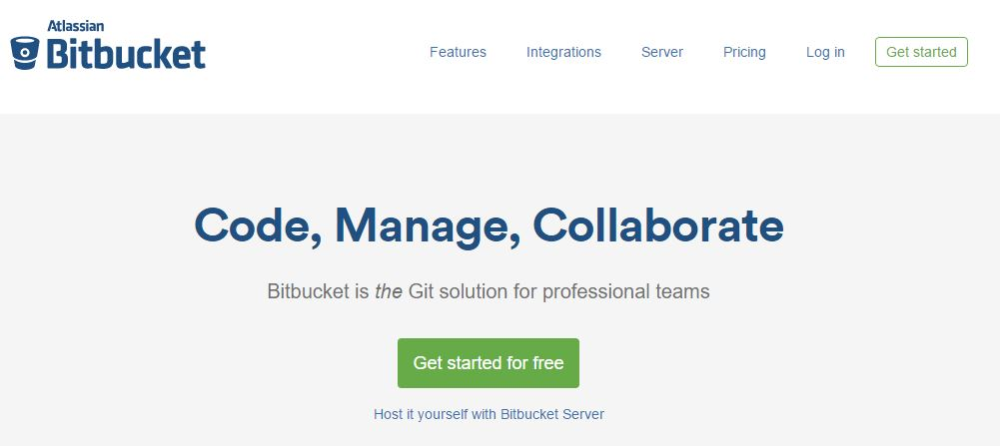

# Creating a Bitbucket Account


## Step 1 - Create the Account

Creating an account at bitbucket.org is only the first step in creating a *useable* account for this course.

Once your join the Team managed by your Instructor, however, it will provide you with many resources for learning and collaboration such as example code, pre-defined configuration files for building VMs, Cheat Sheets, and more.

### Creating an Account at [BitBucket.org](https://bitbucket.org "BitBucket.org")

#### Open any modern web-browser.


#### Navigate to [BitBucket.org](https://bitbucket.org "BitBucket.org")


#### Click the green *Get Started* button at the center or top-right of the screen.


#### Enter email and click *Continue*.
> **Note** - To take advantage of all the tools and learning opportunities within this course, you must register with a ```.edu``` email address.

#### Enter Details and Click *Continue*


#### Check your inbox to verify your email.

> Once you verify your email, also send your Instructor an email with your BitBucket account name so that you can be added to the class Team.

> This gives access to all of the Team Repositories and Projects.


