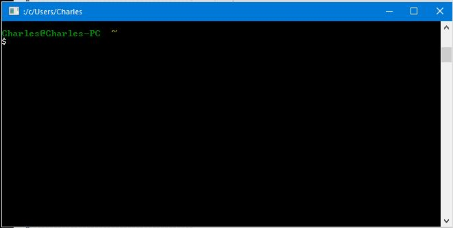
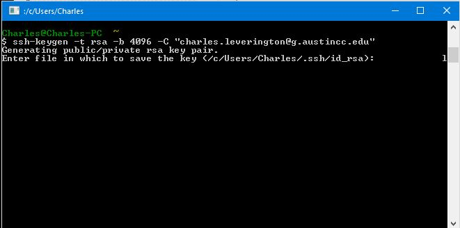
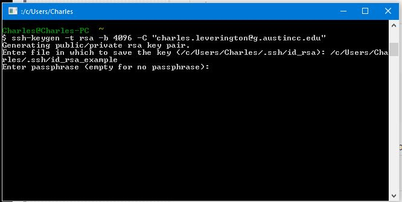
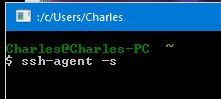
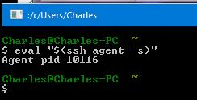

# Creating a GitHub Account


## Step 2 - Create an SSH Key

SSH keys are the digital versions of the car-clicker that unlocks your car as you approach it.
Instead of plugging the key into the door (aka: typing a password), you instead create a keycard called an **SSH Key** and add a copy of the Public version to GitHub. Their computers will compare the Public version they have with the Private version you have, then unlock the car!

> Just like with your real car, you don't have to know **how** the clicker unlocks the car.

> You should instead simply understand that it **does** unlock the car.

### Generating an SSH Key

> The ```~/``` means "current user's root folder" or "your home folder". This is important because the files created at ```~/.ssh``` are only visible and available to you and people who have Administrator access to the computer where it was installed.

> This means that all SSH Keys should be removed from your GitHub account at the end of the Semester, just to be safe!

#### Check for existing SSH Keys
It is always best to check for existing SSH Keys before starting *any* project. Especially if creating a new project on a computer you have never logged into before. If a Key already exists, contact your Administrator immediately because there is probably a virus on the computer.

The key is created in relation to each *individual* login to a computer, so will located at ```C:\Users\<your-user-name>\.ssh\```. This means that all the other SSH Keys created on the machine do not exist, in the purview of each Student.

> On Linux or Mac machines, this location is instead ```/home/<your-user-name>/.ssh``` or something very similar.

#### Generate the SSH Key
##### Open Git Bash


#####  Enter this command: ```ssh-keygen -t rsa -b 4096 -C "your_email@example.com"```
* When prompted for a location to place the file, just press Enter.

> Because this SSH Key can be used for **all** of your Git repositories (and Remote Hosts), it does not matter what directory your are in when the command is executed.

##### When prompted, enter a passphrase, for security.


> **Warning** - You *can* hit enter here to have **no** passphrase on your SSH Keys. This is not a Best Practice because anyone who retrieves a copy of your SSH Key (such as an Administrator or another User with Administrative privileges) has unlimited access to any of your repositories.


#### Add the SSH Key to ```ssh-agent```
Git for Windows and Git Bash come with a great tool called ```ssh-agent```.

This useful package locally stores *your* SSH information so that you do not have to input your GitHub password each time you ```push``` or ```pull``` content from GitHub.

##### Turn on the ```ssh-agent```
**Only on Git for Windows**
* Enter this command: ``` ssh-agent -s ```


> **Note** - On Git Bash, the SSH-Agent is already activated, but you can check your PID using the following command:

 ```
 $eval "$(ssh-agent -s)"
 ```
 

##### Add SSH Key to ```ssh-agent```
* Enter this command: ```ssh-add ~/.ssh/id_rsa```


