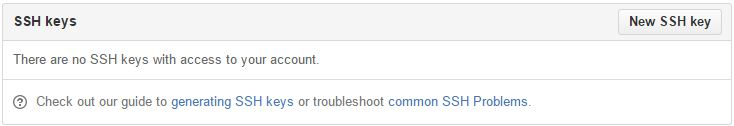

# Creating a GitHub Account


## Step 3 - Add the SSH Key to GitHub

### Adding the SSH Key to [GitHub.com](https://github.com "GitHub.com")

#### Open any modern web-browser.

#### Navigate to [GitHub.com](https://github.com "GitHub.com") and Login


#### Open User Settings and Navigate to ```SSH and GPG Keys``` Link
##### Open User Settings


##### Navigate to ```SSH and GPG Keys``` Link


#### Click *New SSH Key*


#### Enter SSH Key
> Use a Title that will specify exactly what Device you are accessing your GitHub account with.

> Example:  ```ACC-Computer_Lab_Seat_5```


##### Get *Public* SSH Key for GitHub
You must have the *right* text to enter into GitHub. There were two files created with your SSH Key: ```id_rsa``` and ```id_rsa.pub```.

The ```.pub``` stands for **public** in this instance and will be the file used.  Instead of the complicated process of trying to find the file on your local system, there is a very quick and short command you can execute within Git Bash to retrieve the code for pasting in GitHub:
```
clip < ~/.ssh/id_rsa.pub
```


If successful, you will see a screen similar to this:


