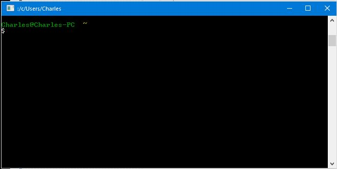
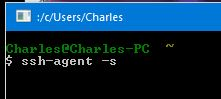

# Creating a GitHub Account


## Step 2 - Create an SSH Key

SSH keys are the digital versions of the car-clicker that unlocks your car as
you approach it.  Instead of plugging the key into the door (aka: typing a
password), you instead create a clicker called an **SSH Key** and add a copy of
the **Public** version to GitHub (and other remote services).  Your computer and
GitHub's servers will compare the public and private keys and if they are a
match, the car will be unlocked!

### Generating an SSH Key - Background

- Home Directory: `~/` means "current user's home folder". This is important
because the files created at `~/.ssh` **should** only be visible to you and
people who have Administrator access to the computer where it was installed.

- Permissions: You can check permission on your ssh keys by using this command
`ls -la`.  If you notice that your key created later in the tutorial has looser
permissions than `-rw-------` you should use this command to restrict the
permissions `chmod 600 name_of_key_without_dot_pub`.

#### The ~/.ssh directory

It is always best to check for existing SSH Keys before starting *any* project.
You don't want to accidentally overwrite your old keys and lose access to a
remote server.

The key is created in relation to each *individual's home folder*

> Windows Machines: `C:\Users\<your-user-short-name>\.ssh\`.

> Linux: `/home/<your-user-short-name>/.ssh`.

> Mac: `/Users/<your-user-short-name>/.ssh`

#### Generate the SSH Key

##### Open Git Bash (Windows), Utilities > Terminal (Mac), Console (Linux)



#####  Enter this command:

`ssh-keygen -t rsa -b 4096 -C "your_email@example.com"`


- When prompted for a location to place the file, this defaults to your home
directory and creates the default (fallback key) for all ssh connections.

##### When prompted, enter a passphrase, for security.


- **Warning** - You *can* hit enter here to have **no** passphrase on your SSH
Keys. This is not a Best Practice because anyone who has access to your SSH Key
file (such as an Administrator or another User with Administrative privileges)
has unlimited access to any of your repositories.

- **Warning** - If you forget your password for your ssh key you will lose
access to the remote server.  So be sure to pick something you won't forget.

#### Windows Only: Add the SSH Key to `ssh-agent`

Git for Windows and Git Bash come with a great tool called `ssh-agent`.

This useful package locally stores *your* SSH information so that you do not
have to input your GitHub password each time you `push` or `pull` content from
GitHub.

##### Turn on the ```ssh-agent```

**Only on Git for Windows**

* Enter this command: `ssh-agent -s`



- **Note** - On Git Bash, the SSH-Agent is already activated, but you can check
your PID using the following command:

```
$eval "$(ssh-agent -s)"
```


##### Add SSH Key to `ssh-agent`

* Enter this command: `ssh-add ~/.ssh/id_rsa`


